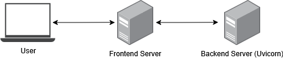

Advanced XSS Web Application Readme
===================================

.. contents:: :local:

Background
----------
This repository stores the whole architecture for a web application tailored for
Advanced XSS experiments.

Architecture
------------
It comprises various components. The diagram for the whole architecture of
the web applicaiton is shown in the image below.

Frontend
^^^^^^^^
It consists of HTML and JavaScript files that provide the user interface for the application.

Backend
^^^^^^^
It processes the requests from the frontend and serves the necessary data.
It is built for the sake of completeness, but it is not high of an importance in this project.
